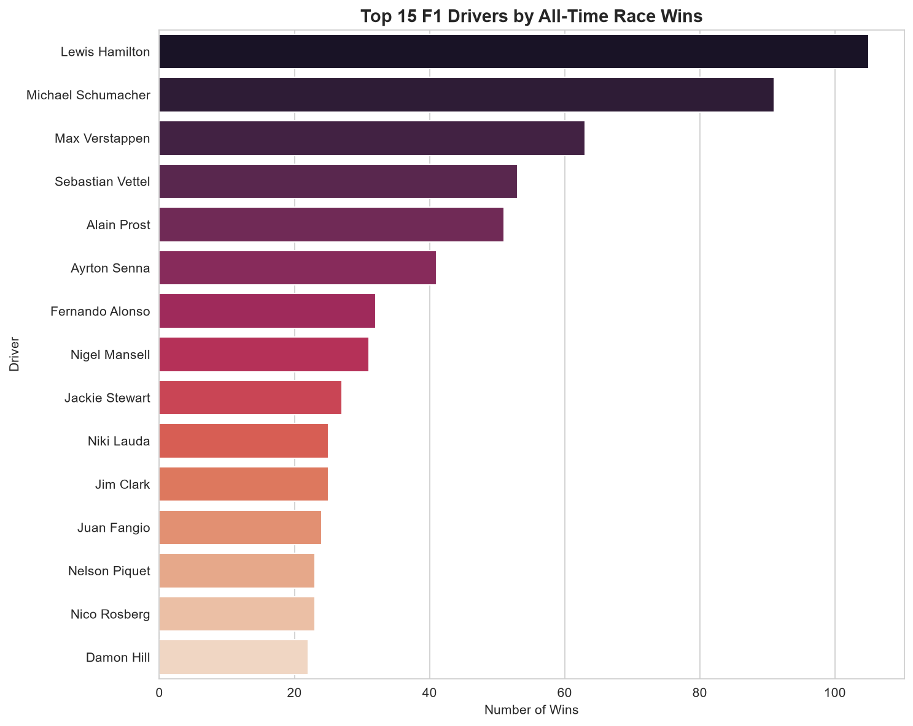
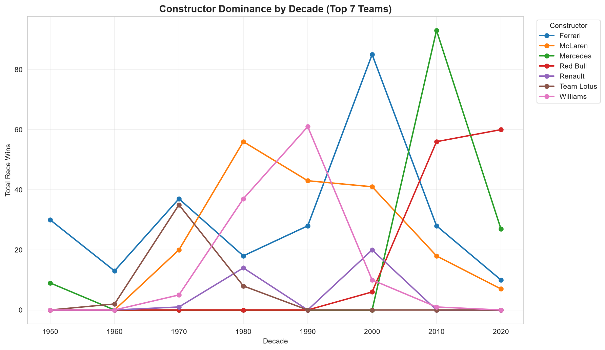
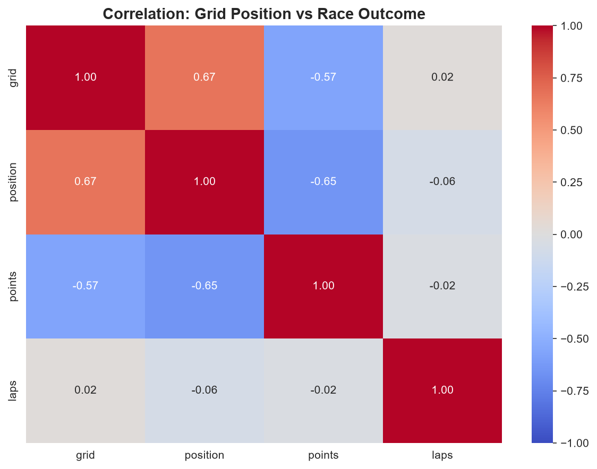
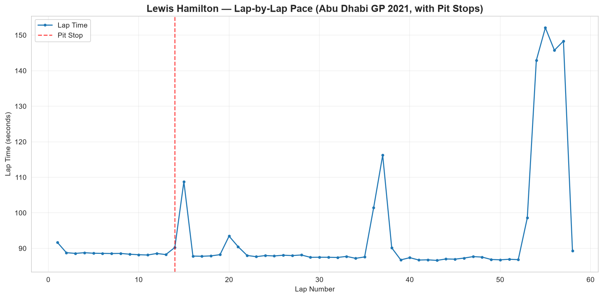

# 🏎️ F1 Analytics Dashboard

**An end-to-end Formula 1 analytics project — from raw multi-table data to a deployed interactive dashboard with a custom driver-rating system and a machine learning prediction module.**


---
**Status:** 🚧 In progress — Day 7/14 (SQL integration with SQLite)

## Table of Contents
- [Overview](#-overview)
- [Dataset](#-dataset)
- [Key Insights So Far](#-key-insights-so-far)
- [Project Roadmap](#-project-roadmap)
- [Project Structure](#-project-structure)
- [Getting Started](#-getting-started)
- [Tech Stack](#-tech-stack)

---

## 📌 Overview

Formula 1's official historical dataset spans **75 years and 14 relational tables** — driver results, lap times, pit stops, qualifying, standings, and more. This project builds a full analytics pipeline on top of it:

1. Cleans and merges the raw relational tables into a single analysis-ready dataset,
2. Explores driver, constructor, and circuit history through visual analytics,
3. Builds a **custom Elo-style rating system** from teammate head-to-head results — a driver-skill measure that isn't just "who had the fastest car",
4. Layers in SQL querying alongside pandas,
5. Serves everything through an interactive **Streamlit** dashboard, including a machine-learning module that estimates podium probability.

This is a **project-based learning build**, developed incrementally and documented day-by-day (see [Project Roadmap](#-project-roadmap)) rather than uploaded as a single finished dump — the commit history reflects the actual build process.

---

## 🗂️ Dataset

- **Source:** [Formula 1 World Championship 1950–2025](https://www.kaggle.com/datasets/rohanrao/formula-1-world-championship-1950-2020) (Kaggle)
- **Raw tables used:** `drivers`, `constructors`, `races`, `results`, `circuits`, `status`, `lap_times`, `pit_stops`
- **Merged master dataset:** 26,759 race results × 34 columns, spanning 1950–2025
- **Missing-value handling:** disguised nulls (`\N`, a MySQL-export artifact) converted to proper `NaN` at load time — see [Getting Started](#-getting-started) for reproducing this from raw data

Raw CSVs are gitignored (fetched from Kaggle directly); `data/processed/master_results.csv` — the cleaned, merged dataset — is committed so downstream notebooks don't need to rebuild it from scratch.

---

## 🔍 Key Insights So Far

<table>
<tr>
<td width="50%">



**Hamilton and Schumacher lead by a wide margin** — 105 and 91 all-time wins respectively, with Verstappen already 3rd on 63 despite an active, still-growing career.

</td>
<td width="50%">



**Constructor dominance is cyclical, not permanent:** McLaren (80s), Williams (90s), Ferrari (2000s), Mercedes (2010s hybrid era), and Red Bull (2020s) each had a defined multi-year peak — no team stays on top forever.

</td>
</tr>
<tr>
<td width="50%">



**Qualifying is the strongest predictor of the race result:** grid position correlates at **+0.67** with finishing position — start further back, finish further back, on average.

</td>
<td width="50%">



**Tyre degradation is visible lap-by-lap:** pace steadily drops through a stint, resets sharply after each pit stop (red lines) — and the 2021 Abu Dhabi GP's late safety-car period shows up as a clear anomaly in the data itself.

</td>
</tr>
</table>

*(43% of all F1 results in history are non-classified finishes (DNF/DNQ/withdrew) — reliability has historically been as much a factor as raw pace.)*

---

## 🗺️ Project Roadmap

This project is being built as a structured, 14-day learning sprint. Status reflects actual progress, updated as each stage completes.

| Day | Focus | Status |
|---|---|---|
| 1 | Project setup, environment, relational data exploration | ✅ Done |
| 2 | Data cleaning & merging (Pandas) | ✅ Done |
| 3 | EDA — driver & constructor history | ✅ Done |
| 4 | EDA — circuit reliability & correlation analysis | ✅ Done |
| 5 | Lap-time pace & pit-stop efficiency analysis | ✅ Done |
| 6 | Teammate battles + custom Elo driver-rating system | ✅ Done |
| 7 | SQL integration (SQLite) | ✅ Done |
| 8 | Streamlit dashboard — skeleton & multi-page structure | 🚧 In progress |
| 9–11 | Interactive dashboard pages (Explorer, Race Deep-Dive, Elo Leaderboard) | ⬜ Planned |
| 12 | ML module — podium probability prediction | ⬜ Planned |
| 13 | Polish, caching, performance, UI theming | ⬜ Planned |
| 14 | Deployment (Streamlit Community Cloud) + final docs | ⬜ Planned |

---

## 📁 Project Structure

```
f1-analytics-dashboard/
├── app/                          # Streamlit dashboard (from Day 8)
├── data/
│   ├── raw/                      # Kaggle CSVs — gitignored, see Getting Started
│   └── processed/
│       └── master_results.csv    # cleaned, merged dataset
├── notebooks/
│   └── 01_data_exploration.ipynb # cleaning, EDA, analytics (Days 1-7)
├── reports/
│   └── figures/                  # exported chart images used in this README
├── src/                          # reusable Python modules (from Day 6+)
├── requirements.txt
├── .gitignore
└── README.md
```

---

## ⚡ Getting Started

```bash
# 1. Clone
git clone https://github.com/mohitbadetiya/f1-analytics-dashboard.git
cd f1-analytics-dashboard

# 2. Set up environment
python -m venv venv
venv\Scripts\activate        # Mac/Linux: source venv/bin/activate
pip install -r requirements.txt

# 3. Get the data
# Download from Kaggle: rohanrao/formula-1-world-championship-1950-2020
# Place all extracted CSVs into data/raw/

# 4. Run the notebook
jupyter notebook
# → open notebooks/01_data_exploration.ipynb
```

---

## 🧰 Tech Stack

| Layer | Tools |
|---|---|
| Data wrangling | pandas, numpy |
| Visualization | matplotlib, seaborn |
| Database / querying | SQLite (from Day 7) |
| Dashboard | Streamlit, Plotly (from Day 8) |
| Machine learning | scikit-learn (from Day 12) |
| Version control | Git, GitHub |

---

## 🙋 Author

**Mohit Badetiya** — [GitHub @mohitbadetiya](https://github.com/mohitbadetiya)

